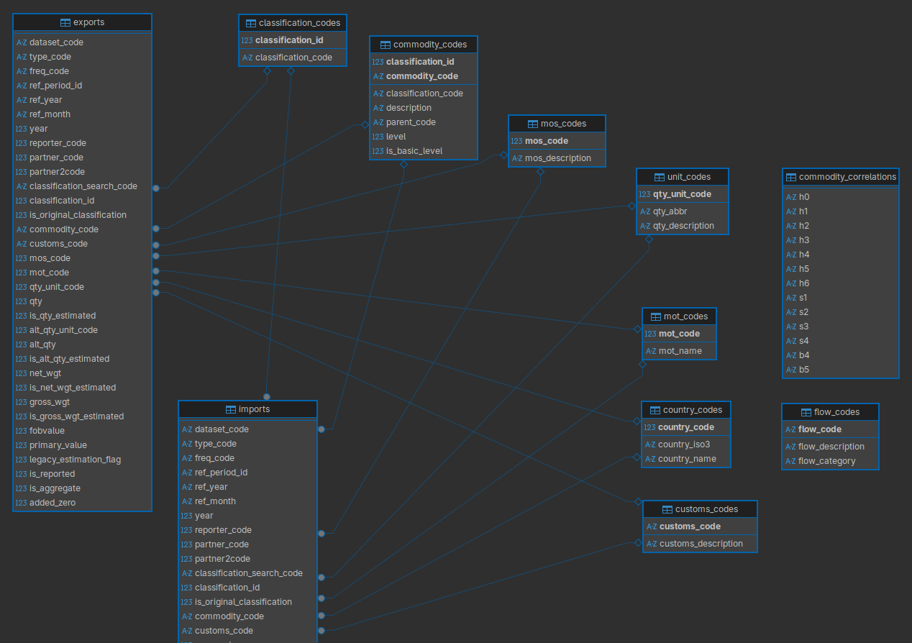
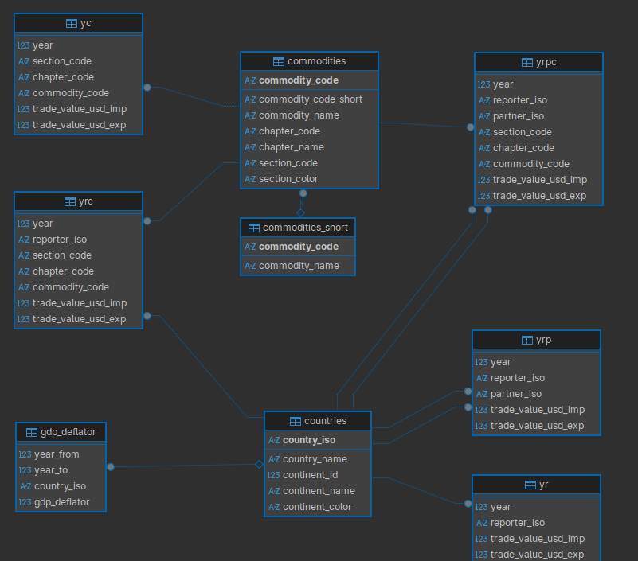

# Curated International Trade Data Derived from UN Comtrade Plus

## Overview

This repository contains scripts for processing and harmonizing UN Comtrade Plus dataset spanning 1988 to 2023. The workflow transforms raw trade data into a clean, standardized PostgreSQL database with consistent product classifications and country codes.

## Key Features

- 35 years of international trade data (1988-2023)
- All data converted to HS22 (H6) standard from original reporter classifications (HS92, SITC Rev 2, etc.)
- Consistent ISO-3 Alpha codes for all countries
- Optimized PostgreSQL schema with proper indexing and relationships
- Extensive data validation and cleaning processes

This represents a decade of experience working with international trade data, incorporating lessons learned from handling various data quality issues and inconsistencies inherent in cross-country trade reporting.

## Ready-to-Use Dataset

For researchers, analysts, and organizations requiring immediate access to this cleaned and harmonized dataset, a production-ready version is available for 995 CAD (~700 USD).

**[Access the Complete Dataset →](https://buymeacoffee.com/pacha/e/456610)**

What you get:

- Complete PostgreSQL dump with all processed data
- Comprehensive documentation and data dictionary
- Schema optimized for analytical queries
- Significant time savings (avoiding the 3+ day processing time)

This curated dataset represents substantial value-add over raw UN Comtrade data through systematic cleaning, harmonization, and quality assurance processes. The pricing reflects the extensive development time and expertise required to produce research-grade international trade data.

*Note: This is a derived analytical dataset created through substantial processing of UN Comtrade data. Distribution complies with UN Comtrade terms of use and I cannot reshare
the raw data.*

Clean Comtrade database diagram:

Tidy derived database diagram:

