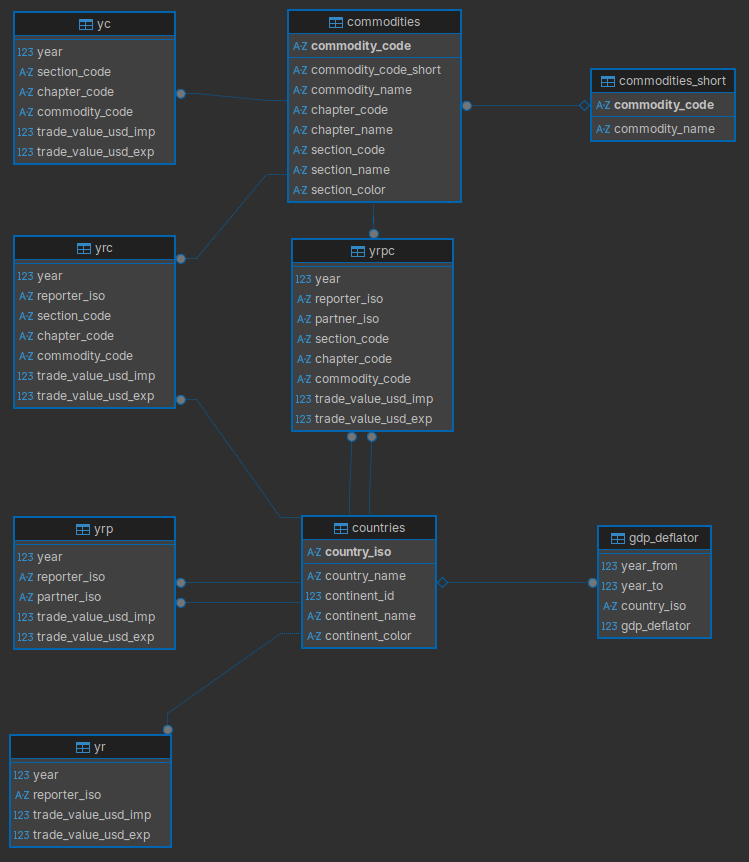

# UN COMTRADE Datasets in Arrow Parquet

These script download the UN Comtrade Plus dataset from 1988 to 2023.

The downloaded files are saved locally in RDS and then I converted these to HS22 (or H6) from the original
classifications provided by each reporter (e.g. HS92, SITC rev 2, etc).

The final tables are written to a PostgreSQL database.

These scripts reflect my personal workflow and ten years of working with intenational trade data. I have added multiple
data cleaning steps and transformations to provide consistent ISO-3 codes for reporters and partners, and to harmonize
the product classifications to HS22.

Running these scripts took around three days to complete, mostly because the downloads from UN Comtrade are slow and the
validation and cleaning steps are time consuming.

Clean Comtrade database diagram:

Tidy derived database diagram:

